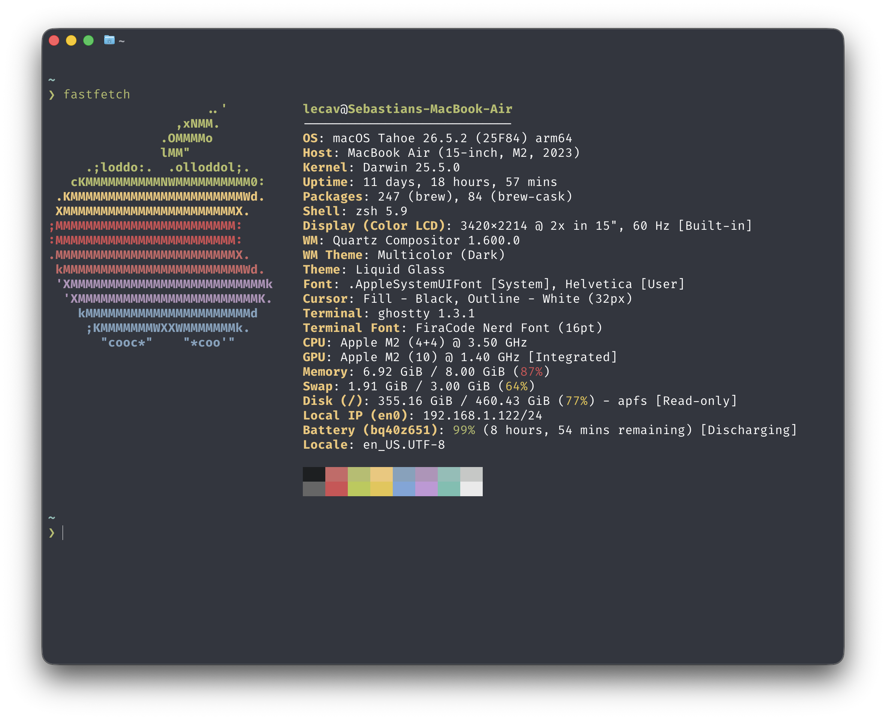

# macOS dotfiles

Personal configuration files for macOS. This repository tracks settings, not
application caches or package-manager state.



## Everyday setup

- Graphical editor: [Zed](https://zed.dev/)
- Terminal editors: [Neovim](https://neovim.io/) (`nvim`) and
  [Helix](https://helix-editor.com/) (`hx`)
- Terminals: [Ghostty](https://ghostty.org/) and Warp
- Shell: Zsh (main), with Fish kept in sync as an alternative
- Prompt and navigation: [Starship](https://starship.rs/) and
  [zoxide](https://github.com/ajeetdsouza/zoxide)
- File manager: [Yazi](https://yazi-rs.github.io/) (`yazi` / `yy`)

`codexbar` is installed as a cask but used from the terminal only:

```sh
codexbar usage
```

## Tracked configuration

| Path           | Tool         | Notes                                                                           |
| -------------- | ------------ | ------------------------------------------------------------------------------- |
| `zsh/`         | Zsh          | Main shell configuration and aliases.                                           |
| `fish/`        | Fish         | Alternative shell, kept aligned with the Zsh aliases and development paths.     |
| `.wezterm.lua` | WezTerm      | Legacy terminal profile; WezTerm is not installed.                              |
| `kitty/`       | Kitty        | Legacy terminal profile; Kitty is not installed.                                |
| `yazi/`        | Yazi         | Catppuccin-style theme. `yy` changes the parent shell directory after quitting. |
| `helix/`       | Helix        | Active terminal-editor preferences and language configuration.                  |
| `git/`         | Git          | Global ignore additions.                                                        |
| `gitui/`       | GitUI        | Main terminal Git interface with Vim-like key bindings.                         |
| `posting/`     | Posting      | Legacy HTTP client configuration, retained for reference.                       |
| `zed/`         | Zed          | Main graphical editor; settings and keymap only, with runtime data ignored.     |
| `borders/`     | JankyBorders | Border style used by the AeroSpace configuration.                               |

## Installed command-line tools

These are the direct Homebrew formulae reported by `brew leaves` on this Mac;
Homebrew dependencies are intentionally omitted. They are an inventory, not a
claim that every tool is used daily.

| Area                       | Packages                                                                                                                                        |
| -------------------------- | ----------------------------------------------------------------------------------------------------------------------------------------------- |
| Shell and terminal         | `bat`, `bottom`, `eza`, `fastfetch`, `fd`, `fish`, `fzf`, `ripgrep-all`, `starship`, `zoxide`, `zsh-autosuggestions`, `zsh-syntax-highlighting` |
| Editors and source control | `biome`, `clang-format`, `gh`, `git`, `gitui`, `helix`, `neovim`                                                                                |
| Languages and build tools  | `cmake`, `deno`, `gradle@8`, `jenv`, `luarocks`, `ninja`, `nvm`, `pkgconf`, `pylint`, `python@3.12`, `watchman`                                 |
| Developer platforms        | `azure-cli`, `cocoapods`, `ios-deploy`, `microsoft/mssql-release/mssql-tools18`, `mysql`, `mysql-connector-c++`, `mysql@8.4`, `nuget`           |
| Documents and media        | `ffmpegthumbnailer`, `fonttools`, `imagemagick`, `pandoc`, `poppler`, `unar`                                                                    |
| Other utilities            | `curl`, `harlequin`, `jq`, `largemodgames/spotatui/spotatui`, `mole`, `pass`, `switchaudio-osx`, `yazi`                                         |

Useful configured commands include `ff` (FZF with a Bat preview), `yy` (Yazi),
and the `eza`-based `ls` aliases in both shells.

## Installed applications and casks

- Terminal/developer: Codex, CodexBar, DBeaver Community, Ghostty, GitHub,
  Glide Browser, PortKiller, Warp, and Zulu 17.
- Other applications: Obsidian, MacTeX, and SF Symbols.
- Fonts: the Nerd Fonts collection is installed; terminal configurations refer
  to `MonoLisa Nerd Font Mono`, which is separately obtained and not managed
  by Homebrew here.

To refresh this inventory after installing or removing packages:

```sh
brew leaves
brew list --cask
```

## Inactive configuration candidates

AeroSpace is retained as **inactive**. It is not loaded by the documented default setup: AeroSpace has
`start-at-login = false`, and no Tmux or CAVA startup is configured here.

| Config                      | Keep when                                                       | Remove when                                                             |
| --------------------------- | --------------------------------------------------------------- | ----------------------------------------------------------------------- |
| `aerospace/` and `borders/` | You plan to return to tiling windows.                           | AeroSpace and JankyBorders are uninstalled and no longer wanted.        |

## Symlinks

Run from `$HOME` only if you want to enable the alternative configuration:

```sh
ln -s -f .config/.tmux.conf
ln -s -f .config/.wezterm.lua
```
